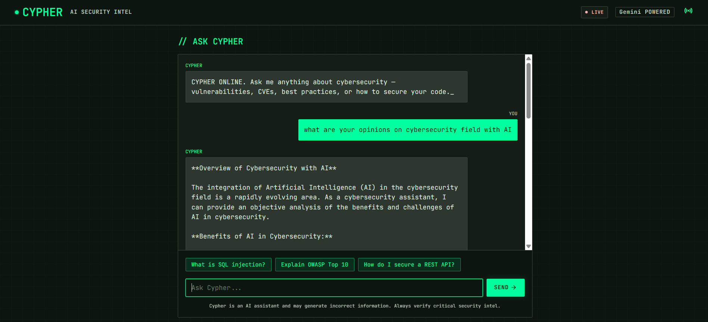

# ⚡ Cypher — AI Cybersecurity Intelligence Assistant

> A real-time cybersecurity intelligence platform powered by AI. Get instant answers on vulnerabilities, CVEs, security best practices, and the latest threat news — all in one place.


---

## 🖥️ Live Demo

> **[cypher-demo.up.railway.app](https://cypher-demo.up.railway.app)** ← replace with your live URL after deployment

---

## 📸 Preview

<!-- Add a screenshot here after deployment -->
<!--  -->

---

## ✨ Features

- **AI Chat Assistant** — Ask anything about cybersecurity: XSS, SQLi, CSRF, CVEs, OWASP Top 10, network security, secure coding, and more
- **Live Threat Feed** — Real-time cybersecurity news cards from top sources (The Hacker News, BleepingComputer, CISA, CVE Database)
- **Context-Aware Conversations** — Remembers the last 10 messages for natural back-and-forth dialogue
- **Responsible AI** — Will never provide exploit code or assist with illegal activity
- **Dark UI** — Clean, terminal-inspired interface built for security professionals

---

## 🛠️ Tech Stack

| Layer | Technology |
|---|---|
| Backend | Django 4.2 |
| AI Model | Llama 3.3 70B via Groq API |
| Frontend | HTML, Tailwind CSS, Vanilla JS |
| Deployment | Railway |

---

## 🚀 Run Locally

### Prerequisites
- Python 3.10+
- A free [Groq API key](https://console.groq.com)

### Setup

```bash
# 1. Clone the repo
git clone https://github.com/Dhawal-Menaria/Cypher.git
cd Cypher

# 2. Create and activate virtual environment
python -m venv venv
venv\Scripts\activate        # Windows
# source venv/bin/activate   # Mac/Linux

# 3. Install dependencies
pip install -r requirements.txt

# 4. Create .env file
cp .env.example .env
# Then open .env and add your keys

# 5. Run migrations
python manage.py migrate

# 6. Start the server
python manage.py runserver
```

Visit **http://127.0.0.1:8000**

---

## 🔑 Environment Variables

Create a `.env` file in the root directory:

```env
GROQ_API_KEY=your-groq-api-key-here
DJANGO_SECRET_KEY=your-django-secret-key-here
DEBUG=True
```

Get your free Groq API key at [console.groq.com](https://console.groq.com)

---

## 💬 What Cypher Can Answer

- **Vulnerabilities** — SQL Injection, XSS, CSRF, SSRF, Buffer Overflow
- **Frameworks** — OWASP Top 10, NIST, MITRE ATT&CK
- **CVEs** — How to read and understand CVE reports
- **Secure Coding** — Best practices for Django, REST APIs, authentication
- **Tools** — Nmap, Burp Suite, Wireshark (educational context)
- **Cryptography** — AES, RSA, hashing, TLS explained simply
- **Cloud Security** — AWS/GCP misconfiguration risks

> ⚠️ Cypher is an educational assistant. It will not provide working exploit code or assist with attacking real systems.

---

## 📁 Project Structure

```
Cypher/
├── chatbot/
│   ├── views.py        # AI chat endpoint + home view
│   └── urls.py         # URL routing
├── cypher/
│   ├── settings.py     # Django configuration
│   └── urls.py         # Root URL config
├── templates/
│   ├── base.html       # Base layout
│   └── index.html      # Main page (news + chat)
├── manage.py
├── requirements.txt
└── .env                # Your API keys (never commit this)
```

---

## 🌐 Deploy to Railway (Free)

```bash
# 1. Push your code to GitHub

# 2. Go to railway.app → New Project → Deploy from GitHub repo

# 3. Add environment variables in Railway dashboard:
#    GROQ_API_KEY, DJANGO_SECRET_KEY, DEBUG=False

# 4. Add a Procfile in root:
#    web: gunicorn cypher.wsgi
```

---

## 🤝 Built By

**Dhawal Menaria** — Django & AI Integration Developer

[](https://upwork.com)
[](https://github.com/Dhawal-Menaria)

---

## 📄 License

MIT License — free to use, modify, and distribute.